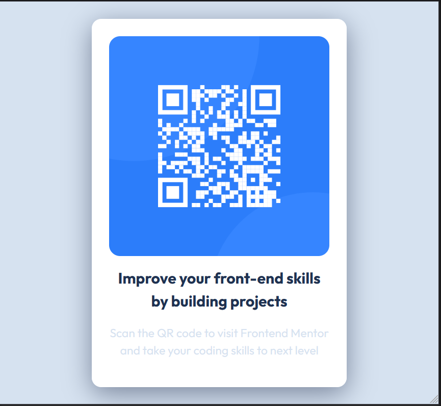

# Frontend Mentor - QR code component solution

This is a solution to the [QR code component challenge on Frontend Mentor](https://www.frontendmentor.io/challenges/qr-code-component-iux_sIO_H). Frontend Mentor challenges help you improve your coding skills by building realistic projects. 

## Table of contents

- [Overview](#overview)
  - [Screenshot](#screenshot)
  - [Links](#links)
- [My process](#my-process)
  - [Built with](#built-with)
  - [What I learned](#what-i-learned)
- [Author](#author)

## Overview

### Screenshot

### Links

- Solution URL: [Click Here](https://github.com/abdullahakram36/css-projects/tree/main/QR-Code)
- Live Site URL: [Add live site URL here](https://your-live-site-url.com)

## My process

### Built with

- Semantic HTML5 markup
- CSS custom properties
- Flexbox
- Mobile-first workflow

### What I learned

I learned how to create responsive sites and scale as resultion grows.

## Author

- Website - [Abdullah Akram](https://www.your-site.com)
- Frontend Mentor - [@abdullahakram36](https://www.frontendmentor.io/profile/abdullahakram36)
- Twitter - [@abdullahakram36](https://www.twitter.com/abdullahakram36)
